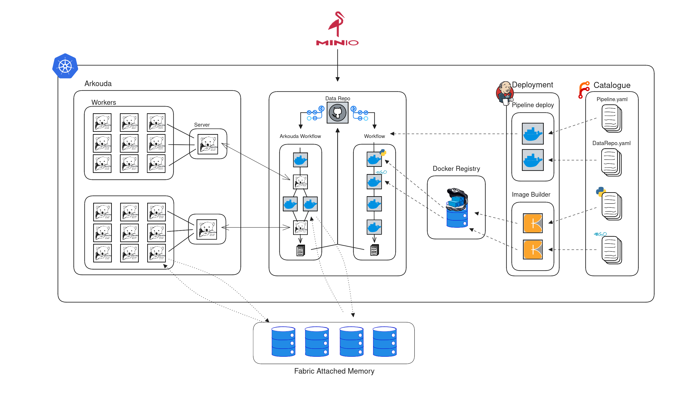

# 📊 Pachykouda: HPC Workflow Integration with Pachyderm and Arkouda

`Pachykouda` integrates the prowess of [Pachyderm](https://www.pachyderm.com/) and [Arkouda](https://github.com/Bears-R-Us/arkouda), presenting a template for crafting intricate high-performance computing (HPC) workflows. Pachyderm specializes in the creation of data-driven workflows, while Arkouda shines in executing parallelized computations on vast datasets.

## 📌 Overview

With `Pachykouda`, you'll navigate through the setup, integration, and deployment of:

- **Kubernetes Cluster**: Set up with 20 nodes on the Heydar machines, using flannel as a network overlay.
- **Pachyderm**: See a [live installation](http://heydar20.labs.hpecorp.net:30080/) operating on the cluster.
- **Minio Server**: Operates on bare metal on the heydar20 node, providing S3-compatible object storage for Pachyderm.
- **Arkouda**: Features a containerized rendition of HPE's tailored Arkouda solution, optimized for Fabric-Attached Memory (FAM). (In Progress)
  - **Arkouda-Proxy**: Flawlessly merged into the Pachyderm process.
  - **Arkouda-Workers**: A scalable suite fortified with FAM.
- **Docker Registry**: A repository that spans the entire cluster, reserved for Pachykouda-Catalog images.
- **Pachykouda-Catalog**: Repository of Code available as source for Pachyderm Pipelines, taken from the Clasp-Catalog and modified for Pachyderm. (Coming Soon!)
- **FAM-Based Container Communication**: Leveraging FAM to achieve high-performance data transfer between containers. (Coming Soon!)



## 🏗️ Project Layout

Explore the main sections of the project:

- **[Kubernetes_Setup](./Kubernetes_Setup/README.md)**: Comprehensive resources for initiating the Kubernetes cluster and complete CI/CD setup on Heydar machines, complemented with utility scripts.
- **[Kymera](./Kymera/README.md)**: Houses Docker files and documentation for the Arkouda-Proxy and Arkouda-Worker images.
- **[Minio](./Minio/README.md)**: Offers detailed guides and configuration elements for the Minio installation.
- **[Pachyderm](./Pachyderm/README.md)**: Offers detailed guides and configuration elements for the Pachyderm installation.

``` plaintext
├── Kubernetes_Setup
│   ├── ci_cd
│   │   ├── forgejo
│   │   └── jenkins
│   │       ├── custom_jenkins_container
│   │       └── Pachykouda-Jenkins-Pipeline    
│   ├── kluster
│   │   ├── tools
│   │   └── setup_scripts
│   └── registry
├── Kymera
│   ├── Arkouda
│   │   ├── arkouda-contrib-temp
│   │   ├── arkouda-docker
│   │   ├── arkouda-helm-charts
│   │   └── config
│   └── base_image
├── Minio
├── Pachyderm
└── README.md
```

## 🔒 Access

### Pachyderm Dashboardk

For internal network access to the Pachyderm dashboard, use:
> <http://heydar20.labs.hpecorp.net:30080/>

### Forgejo

The Webfrontend of the Git Repositories can be found at:
> <http://heydar20.labs.hpecorp.net:30070>

### Jenkins

The jenkins web interface can be found at:
> <http://heydar20.labs.hpecorp.net:30060>

But pulls the pipeline information from the following repo on the  HPE Github:

> <https://github.hpe.com/jon-eckerth/Pachykouda-Jenkins-Pipeline>

### Pachyderm CLI

Creating a Pipeline requires CLI access. Achieve this by installing the Pachyderm CLI or Pachctl tool. Install with:

``` bash
curl -L https://github.com/pachyderm/pachyderm/releases/download/v2.7.0/pachctl_2.7.0_linux_amd64.tar.gz | sudo tar -xzv --strip-components=1 -C /usr/bin/

pachctl connect http://heydar20.labs.hpecorp.net:30650  
```

Once installed, test the cli with:

``` bash
pachctl version
```

The expected output is:

``` bash
COMPONENT           VERSION
pachctl             2.7.0
pachd               2.7.0
```

documentation of the commands is available in the [Pachyderm CLI Documentation](https://docs.pachyderm.com/latest/reference/pachctl/pachctl/).

### Kubernetes CLI

For Kubernetes cluster access via the CLI, install the specified Kubernetes CLI and copy the config file from the master node to your local machine. Install with:

``` bash
curl -LO https://storage.googleapis.com/kubernetes-release/release/v1.18.0/bin/linux/amd64/kubectl

scp <user>@heydar20.labs.hpecorp.net:/etc/kubernetes/admin.conf ~/.kube/config
```

To test the CLI, run:

``` bash
kubectl get nodes
```

### Minio

Access Minio via a web browser:

> <http://heydar20.labs.hpecorp.net:30090>

## 📚 Additional Resources

Delve deeper with comprehensive documentation and installation guidance:

- [Pachyderm Setup](./Pachyderm/README.md)
- [Kubernetes Setup](./Kubernetes_Setup/README.md)
