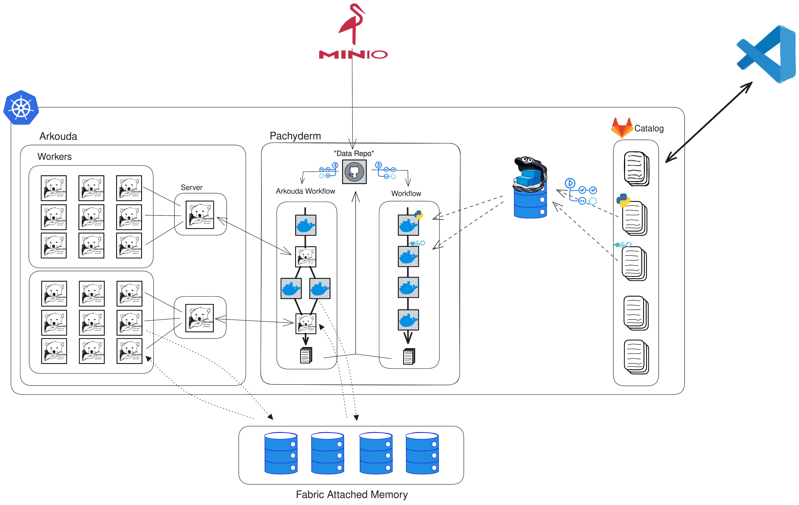

# 📊 Pachykouda: HPC Workflow Integration with Pachyderm and Arkouda

`Pachykouda` integrates the prowess of [Pachyderm](https://www.pachyderm.io/) and Arkouda, presenting a template for crafting intricate high-performance computing (HPC) workflows. Pachyderm specializes in the creation of data-driven workflows, while Arkouda shines in executing parallelized computations on vast datasets.

## 📌 Overview

With `Pachykouda`, you'll navigate through the setup, integration, and deployment of:

- **Kubernetes Cluster**: Set up with 20 nodes on the Heydar machines, using flannel as a network overlay.
- **Pachyderm**: See a [live installation](http://heydar20.labs.hpecorp.net:30080/) operating on the cluster.
- **Minio Server**: Operates on bare metal on the heydar20 node, providing S3-compatible object storage for Pachyderm.
- **Arkouda**: Features a containerized rendition of HPE's tailored Arkouda solution, optimized for Fabric-Attached Memory (FAM). (In Progress)
  - **Arkouda-Proxy**: Flawlessly merged into the Pachyderm process.
  - **Arkouda-Workers**: A scalable suite fortified with FAM.
- **Docker Registry**: A repository that spans the entire cluster, reserved for Pachykouda-Catalog images.
- **Pachykouda-Catalog**: Repository of Code available as source for Pachyderm Pipelines, taken from the Clasp-Catalog and modified for Pachyderm. (Coming Soon!)
- **FAM-Based Container Communication**: Leveraging FAM to achieve high-performance data transfer between containers. (Coming Soon!)



## 🏗️ Project Layout

Explore the main sections of the project:

- **[Kubernetes_Setup](./Kubernetes_Setup)**: Comprehensive resources for initiating the Kubernetes cluster and Registry on Heydar machines, complemented with utility scripts.
- **[Kymera](./Kymera)**: Houses Docker files and extensive documentation for the Arkouda-Proxy and Arkouda-Worker images.
- **[Pachyderm](./Pachyderm)**: Offers detailed guides and configuration elements for the Pachyderm installation.

``` plaintext
Pachykouda
├── Kubernetes_Setup
│   ├── kube-flannel.yml
│   ├── registry
│   ├── tools
│   ├── setup_scripts
│   └── setup_kubernetes.md
├── Kymera
│   ├── Arkouda
│   ├── base_image
│   └── docu.md
├── Pachyderm
│   ├── README.md
│   ├── values.yaml
│   └── volumes.yaml
└── README.md
```

## 🔒 Access

### Pachyderm Dashboard

For internal network access to the Pachyderm dashboard, use:

``` bash
http://heydar20.labs.hpecorp.net:30080/
```

### Pachyderm CLI

Creating a Pipeline requires CLI access. Achieve this by installing the Pachyderm CLI or Pachctl tool. Install with:

``` bash
TBD
```

Once installed, utilize the CLI:

``` bash
TBD
```

Commands are available in the [Pachyderm CLI Documentation](https://docs.pachyderm.com/latest/reference/pachctl/pachctl/).

### Kubernetes CLI

For Kubernetes cluster access via the CLI, install the specified Kubernetes CLI:

``` bash
```

Next, download the kubeconfig file from the master node and position it in the .kube directory:

``` bash
scp <user>@heydar20.labs.hpecorp.net:/etc/kubernetes/admin.conf ~/.kube/config
```

### Minio

Access Minio via a web browser:

``` bash
TBD
```

Alternatively, upload data directly to Minio:

``` bash
mc cp <file> minio/pfs/<repo>/<branch>/<path>
```

## 📚 Additional Resources

Delve deeper with comprehensive documentation and installation guidance:

- [Pachyderm Setup](./Pachyderm/README.md)
- [Kubernetes Setup](./Kubernetes_Setup/README.md)
